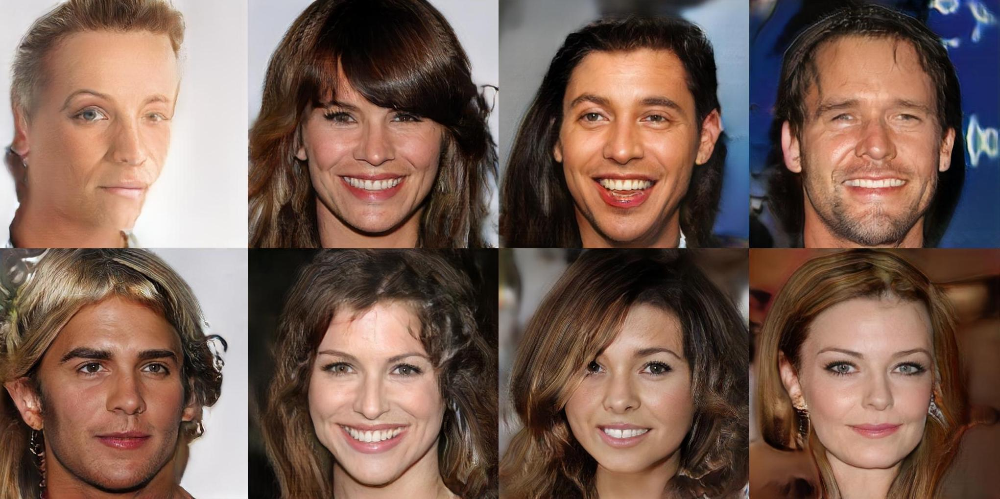

# Fork to Add Albumentations
This is a fork of the Pytorch GAN Zoo, primarily to make it compatible with the Albumentations image augmentations. That's it.
The vanialla GAN-Zoo implementation uses a very basic image augmentation pipeline. Nvidia-research suggests that aggressive image augmentations/transformations is the key to getting high-quality hallucinations with little data

# Pytorch GAN Zoo

A GAN toolbox for researchers and developers with:
- Progressive Growing of GAN(PGAN): https://arxiv.org/pdf/1710.10196.pdf
- DCGAN: https://arxiv.org/pdf/1511.06434.pdf
- StyleGAN (beta): https://arxiv.org/abs/1812.04948

Picture: Generated samples from GANs trained on celebaHQ, fashionGen, DTD.

Picture: fake faces with celebaHQ

This code also implements diverse tools:
- GDPP method from [GDPP: Learning Diverse Generations Using Determinantal Point Process](https://arxiv.org/abs/1812.00068)
- Image generation "inspired" from a reference image using an already trained GAN from [Inspirational Adversarial Image Generation](https://arxiv.org/abs/1906.11661)
- AC-GAN conditioning from [Conditional Image Synthesis With Auxiliary Classifier GANs](https://arxiv.org/abs/1610.09585)
- [SWD metric](https://hal.archives-ouvertes.fr/hal-00476064/document)
- [Inception Score](https://papers.nips.cc/paper/6125-improved-techniques-for-training-gans.pdf)
- Logistic loss from [Which training method of GANs actually converge](https://arxiv.org/pdf/1801.04406.pdf)

## LICENSE

This project is under BSD-3 license.
