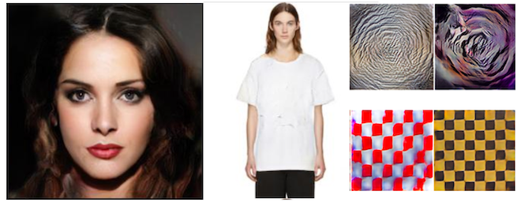

Pytorch GAN Zoo
============

A GAN toolbox for researchers and developers with:
- Progressive Growing of GAN(PGAN): https://arxiv.org/pdf/1710.10196.pdf
- DCGAN: https://arxiv.org/pdf/1511.06434.pdf
- To come: StyleGAN https://arxiv.org/abs/1812.04948


Picture: Generated samples from GANs trained on celebaHQ, fashionGen, DTD.


Picture: fake faces with celeba

This code also implements diverse tools:
- GDPP method (https://arxiv.org/abs/1812.00068)
- Image generation "inspired" from a reference image using an already trained GAN.
- AC-GAN conditioning (https://arxiv.org/abs/1610.09585)
- SWD metric (https://hal.archives-ouvertes.fr/hal-00476064/document)
- Nearest neighbors
- Inception Score (https://papers.nips.cc/paper/6125-improved-techniques-for-training-gans.pdf)

## Requirements

This project requires:
- pytorch
- torchvision
- numpy
- scipy
- h5py (fashionGen)

Optional:
- visdom
- nevergrad (inspirational generation)

If you don't already have pytorch or torchvision please have a look at https://pytorch.org/ as the installation command may vary depending on your OS and your version of CUDA.

You can install all other dependencies with pip by running:

```
pip install -r requirements.txt
```

## Recommended datasets
 - celebA: http://mmlab.ie.cuhk.edu.hk/projects/CelebA.html
 - celebAHQ: https://github.com/nperraud/download-celebA-HQ
 - fashionGen: https://fashion-gen.com/
 - DTD: https://www.robots.ox.ac.uk/~vgg/data/dtd/
 - CIFAR10: http://www.cs.toronto.edu/~kriz/cifar.html

## Quick training

The datasets.py script allows you to prepare your datasets and build their corresponding configuration files.

If you want to waste no time and just launch a training session on celeba cropped

```
python datasets.py celeba_cropped $PATH_TO_CELEBA/img_align_celeba/ -o $OUTPUT_DATASET
python train.py PGAN -c config_celeba_cropped.json --restart -n celeba_cropped
```

And wait for a few days. Your checkpoints will be dumped in output_networks/celeba_cropped. You should get 128x128 generations at the end.

For celebaHQ:

```
python datasets.py celebaHQ $PATH_TO_CELEBAHQ -o $OUTPUT_DATASET - f
python train.py PGAN -c config_celebaHQ.json --restart -n celebaHQ
```

Your checkpoints will be dumped in output_networks/celebaHQ. You should get 1024x1024 generations at the end.

For fashionGen:

```
python datasets.py fashionGen $PATH_TO_FASHIONGEN_RES_256 -o $OUTPUT_DIR
python train.py PGAN -c config_fashionGen.json --restart -n fashionGen
```

The above command will train the fashionGen model up resolution 256x256. If you want to train fashionGen on a specific sub-dataset for example CLOTHING, run:

```
python train.py PGAN -c config_fashionGen.json --restart -n fashionGen -v CLOTHING
```

Four sub-datasets are available: CLOTHING, SHOES, BAGS and ACCESSORIES.

For the DTD texture dataset:

```
python datasets.py dtd $PATH_TO_DTD
python train.py PGAN -c config_dtd.json --restart -n dtd
```

For cifar10:

```
python datasets.py cifar10 $PATH_TO_CIFAR10 -o $OUTPUT_DATASET
python train.py PGAN -c config_cifar10.json --restart -n cifar10
```

## Load a pretrained model with torch.hub

Models trained on celebaHQ, fashionGen, cifar10 and celeba cropped are available with [torch.hub](https://pytorch.org/docs/stable/hub.html).

Checkpoints:
- PGAN:
  - celebaHQ https://dl.fbaipublicfiles.com/gan_zoo/PGAN/celebaHQ_s6_i80000-6196db68.pth
  - celeba_cropped
  - dtd
  - cifar10

- DCGAN
  - fashionGen https://dl.fbaipublicfiles.com/gan_zoo/DCGAN_fashionGen-1d67302.pth

See hubconf.py for how to load a checkpoint !

## GDPP

To apply the GDPP loss to your model just add the option --GDPP true to your training command.

## Advanced guidelines

### How to run a training session ?

```
python train.py $MODEL_NAME -c $CONFIGURATION_FILE[-n $RUN_NAME][-d $OUTPUT_DIRECTORY][OVERRIDES]
```

Where:

1 - MODEL_NAME is the name of the model you want to run. Currently, two models are available:
    - PGAN(progressive growing of gan)
    - PPGAN(decoupled version of PGAN)

2 - CONFIGURATION_FILE(mandatory): path to a training configuration file. This file is a json file containing at least a pathDB entry with the path to the training dataset. See below for more informations about this file.

3 - RUN_NAME is the name you want to give to your training session. All checkpoints will be saved in $OUTPUT_DIRECTORY/$RUN_NAME. Default value is default

4 - OUTPUT_DIRECTORY is the directory were all training sessions are saved. Default value is output_networks

5 - OVERRIDES: you can overrides some of the models parameters defined in "config" field of the configuration file(see below) in the command line. For example:

```
python train.py PPGAN -c coin.json -n PAN --learningRate 0.2
```

Will force the learning rate to be 0.2 in the training whatever the configuration file coin.json specifies.

To get all the possible override options, please type:

```
python train.py $MODEL_NAME --overrides
```

## Configuration file of a training session

The minimum necessary file for a training session is a json with the following lines

```
{
    "pathDB": PATH_TO_YOUR_DATASET
}
```

Where a dataset can be:
- a folder with all your images in .jpg, .png or .npy format
- a folder with N subfolder and images in it
- a .h5 file(cf fashionGen)

To this you can add a "config" entry giving overrides to the standard configuration. See models/trainer/standard_configurations to see all possible options. For example:

```
{
    "pathDB": PATH_TO_YOUR_DATASET,
    "config": {"baseLearningRate": 0.1,
               "miniBatchSize": 22}
}
```

Will override the learning rate and the mini-batch-size. Please note that if you specify a - -baseLearningRate option in your command line, the command line will prevail. Depending on how you work you might prefer to have specific configuration files for each run or only rely on one configuration file and input your training parameters via the command line.

Other fields are available on the configuration file, like:
- pathAttribDict(string): path to a .json file matching each image with its attributes. To be more precise with a standard dataset, it is a dictionary with the following entries:

```
{
    image_name1.jpg: {attribute1: label, attribute2, label ...}
    image_name2.jpg: {attribute1: label, attribute2, label ...}
    ...
}
```

With a dataset in the fashionGen format(.h5) it's a dictionary summing up statistics on the class to be sampled.

- imagefolderDataset(bool): set to true to handle datasets in the torchvision.datasets.ImageFolder format
- selectedAttributes(list): if specified, learn only the given attributes during the training session
- pathPartition(string): path to a partition of the training dataset
- partitionValue(string): if pathPartition is specified, name of the partition to choose
- miniBatchScheduler(dictionary): dictionary updating the size of the mini batch at different scale of the training
ex {"2": 16, "7": 8} meaning that the mini batch size will be 16 from scale 16 to 6 and 8 from scale 7
- configScheduler(dictionary): dictionary updating the model configuration at different scale of the training
ex {"2": {"baseLearningRate": 0.1, "epsilonD": 1}} meaning that the learning rate and epsilonD will be updated to 0.1 and 1 from scale 2 and beyond

## How to run a evaluation of the results of your training session ?

You need to use the eval.py script.

### Image generation

You can generate more images from an existing checkpoint using:
```
python eval.py visualization -n $modelName -m $modelType
```

Where modelType is in [PGAN, PPGAN, DCGAN] and modelName is the name given to your model. This script will load the last checkpoint detected at testNets/$modelName. If you want to load a specific iteration, please call:

```
python eval.py visualization -n $modelName -m $modelType -s $SCALE -i $ITER
```

If your model is conditioned, you can ask the visualizer to print out some conditioned generations. For example:

```
python eval.py visualization -n $modelName -m $modelType --Class T_SHIRT
```

Will plot a batch of T_SHIRTS in visdom. Please use the option - -showLabels to see all the available labels for your model.

### Fake dataset generation

To save a randomly generated fake dataset from a checkpoint please use:

```
python eval.py visualization -n $modelName -m $modelType --save_dataset $PATH_TO_THE_OUTPUT_DATASET --size_dataset $SIZE_OF_THE_OUTPUT
```

### SWD metric

Using the same kind of configuration file as above, just launch:

```
python eval.py laplacian_SWD -c $CONFIGURATION_FILE -n $modelName -m $modelType
```

Where $CONFIGURATION_FILE is the training configuration file called by train.py (see above): it must contains a "pathDB" field pointing to path to the dataset's directory. For example, if you followed the instruction of the Quick Training section to launch a training session on celebaHQ your configuration file will be config_celebaHQ.json.

You can add optional arguments:

- -s $SCALE: specify the scale at which the evaluation should be done(if not set, will take the highest one)
- -i $ITER: specify the iteration to evaluate(if not set, will take the highest one)
- --selfNoise: returns the typical noise of the SWD distance for each resolution

### Inspirational generation

To make an inspirational generation, you first need to build a feature extractor:

```
python save_feature_extractor.py st $pathToTheFeatureExtractor
```

Then run your model:

```
python eval.py inspirational_generation -n $modelName -m $modelType --inputImage $pathTotheInputImage [-f $pathToTheFeatureExtractor]
```

### I have generated my metrics. How can i plot them on visdom ?

Just run
```
python eval.py metric_plot  -n $modelName
```

## LICENSE

This project is under BSD-3 license.
